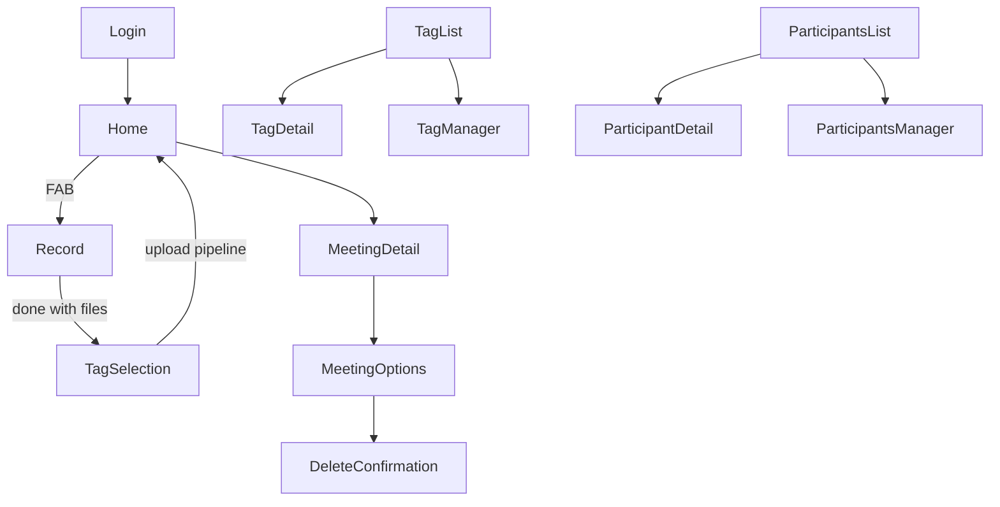
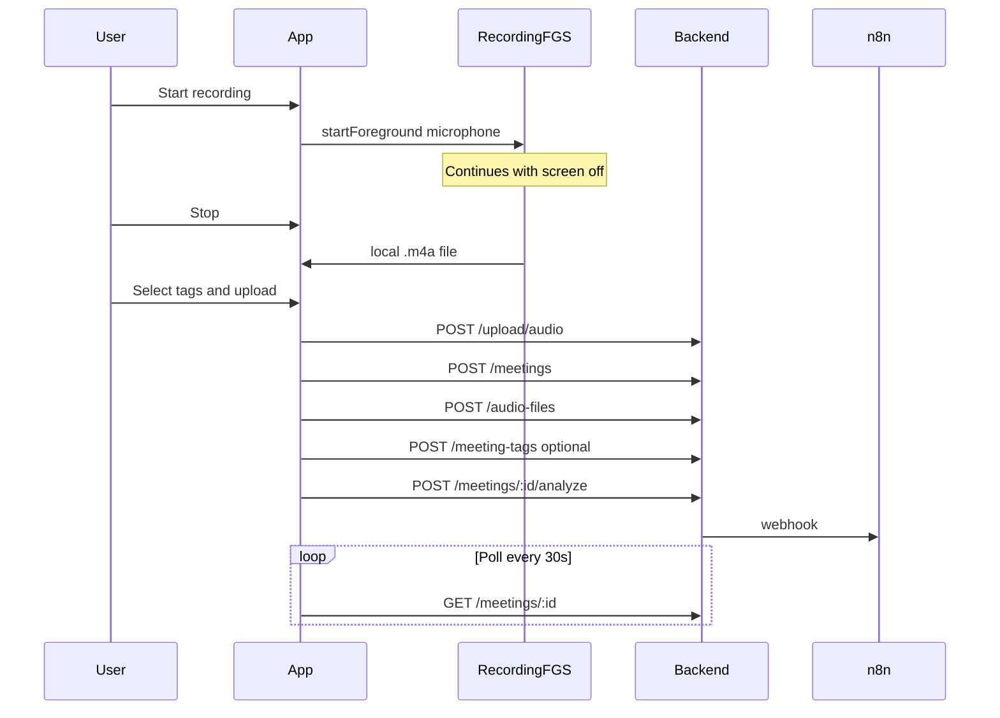

# Neshastyar Android Rewrite Target

> **Read this file first** before writing any Android code in `android-app/`.
> It is the product + API contract for a fully native Android client.
> Web UI lives in `../src/`. Backend API lives in `../backend/`. Do not load UI from the internet.

---

## 0. Mission for the implementing AI

Build a **fully native Kotlin + Jetpack Compose** Android app that:

1. Ships **all UI inside the APK** (no remote WebView, no Capacitor `server.url`, no Lovable remote shell).
2. Talks only to the existing Neshastyar backend for data and uploads.
3. Keeps **microphone recording and file upload running when the screen is off or the device is locked** (Foreground Service + WorkManager).
4. Matches current web feature parity for auth, meetings, tags, participants, account, record/upload.
5. Uses **Persian RTL** UI (Vazirmatn or equivalent) and Jalali dates where the web app does.

| Item | Value |
|------|--------|
| Production API base | `https://neshastyar.com/api` |
| Local API base | `http://<host>:3001/api` |
| Auth header | `Authorization: Bearer <access_token>` |
| App language / layout | `fa` / RTL |
| Stack | Kotlin, Jetpack Compose, MVVM, Retrofit/OkHttp, Room, DataStore (encrypted for tokens), WorkManager |
| Do **not** use | Capacitor, Flutter, React Native, remote HTML UI |

Suggested application id: `com.neshastyar.app` (or keep consistent with Play Store plan). Suggested module root: this folder `android-app/`.

---

## 1. Goals and non-goals

### Goals

- Feature parity with protected web screens (see §3).
- Native mic recording that survives lock screen / Doze (within OEM limits).
- Reliable upload queue with retry after network loss or process death.
- Same create-meeting pipeline as web (`upload → meeting → audio_files → tags → analyze`).
- Secure JWT storage; email-verified users only for API data routes.

### Non-goals

- Rewriting the Node/Express backend or MySQL schema.
- Replacing n8n AI pipeline.
- Capacitor / hybrid wrapper.
- Push notifications for analyze completion (web polls; Android should poll too unless added later).
- iOS (out of scope unless separately requested).

---

## 2. Recommended Android architecture

```text
android-app/
├── androidtarget.md          ← this file
├── app/
│   └── src/main/
│       ├── java/.../
│       │   ├── ui/                 # Compose screens
│       │   ├── navigation/
│       │   ├── data/
│       │   │   ├── api/            # Retrofit interfaces
│       │   │   ├── local/          # Room, DataStore
│       │   │   └── repository/
│       │   ├── recording/          # ForegroundService, recorder
│       │   ├── upload/             # WorkManager workers
│       │   └── di/
│       ├── res/
│       └── AndroidManifest.xml
└── ...
```

### Core patterns

| Concern | Approach |
|---------|----------|
| UI | Jetpack Compose + Navigation Compose |
| State | ViewModel + UiState; single source of truth |
| Network | Retrofit + OkHttp; inject Bearer interceptor |
| Session | EncryptedSharedPreferences or encrypted DataStore |
| Drafts / pending uploads | Room (local file paths, progress, meeting draft metadata) |
| Recording | `RecordingForegroundService` with `foregroundServiceType="microphone"` |
| Upload | WorkManager (`NetworkType.CONNECTED`, exponential backoff, unique work per file) |
| DI | Hilt recommended |

### Why not WebView / Capacitor

The current web app uses browser `MediaRecorder` / `getUserMedia` ([`../src/pages/Record.tsx`](../src/pages/Record.tsx)). Android suspends WebView JS and media when the screen locks. Capacitor config currently points at a remote URL ([`../capacitor.config.ts`](../capacitor.config.ts)) — explicitly forbidden for this rewrite.

---

## 3. Screens and navigation

Mirror web routes from [`../src/App.tsx`](../src/App.tsx).

### 3.1 Public (no JWT required)

| Web path | Screen | Purpose |
|----------|--------|---------|
| `/` | Landing (optional) | CTA to login/signup; if session valid → Home |
| `/login` | Login | Email + password (`dir=ltr` fields) |
| `/signup` | SignUp | Email, password, confirm → then login (no auto-session until verified) |
| `/forgot-password` | ForgotPassword | Request reset email |
| `/verify-email?token=` | VerifyEmail | Deep link / App Link preferred; web email links still use `FRONTEND_URL` |
| `/reset-password?token=` | ResetPassword | New password (min 6) |

### 3.2 Protected (JWT + email verified)

| Web path | Screen | Bottom nav |
|----------|--------|------------|
| `/home` | Home — recent meetings, Jalali date groups | Yes |
| `/record` | Record — mic + multi-file draft + comment | Hide |
| `/tag-selection` | TagSelection — pick tags, upload, create meeting | Hide |
| `/meeting/:id` | MeetingDetail — summary, tags, participants, analyze, email | Yes |
| `/meeting/:id/meeting_details_options` | MeetingOptions — play audio, edit `CommentText`, delete entry | Hide |
| `/meeting/:id/delete` | DeleteConfirmation | Hide |
| `/tags` | TagList | Yes |
| `/tag/:tagId` | TagDetail (`untagged` special id) | Yes |
| `/tags/manage` | TagManager — rename, delete, merge | Hide |
| `/meetings/untagged` | UntaggedMeetings (alternate list) | Hide or Yes |
| `/participants` | ParticipantsList | Yes |
| `/participant/:id` | ParticipantDetail (`no-participants` special) | Yes |
| `/participants/manage` | ParticipantsManager | Hide |
| `/account/manage` | Account — name, baleID, logout | Hide |

### 3.3 Bottom navigation (labels must match)

From [`../src/components/layout/BottomNav.tsx`](../src/components/layout/BottomNav.tsx):

| Position | Label | Destination |
|----------|-------|-------------|
| 1 | خانه | Home |
| 2 | برچسب‌ها | TagList (also active on `/tag/*`, `/tags/*`) |
| Center FAB | ضبط جلسه (aria) | Record |
| 3 | افراد | ParticipantsList (also active on participant routes) |
| 4 | تنظیمات | Account |

### 3.4 Key user flows





---

## 4. Auth contract

Sources: [`../backend/src/routes/auth.js`](../backend/src/routes/auth.js), [`../backend/src/routes/email.js`](../backend/src/routes/email.js), [`../src/store/useAuthStore.ts`](../src/store/useAuthStore.ts), [`../src/lib/mysql-client.ts`](../src/lib/mysql-client.ts).

### 4.1 Session shape (store this securely)

```json
{
  "access_token": "<jwt>",
  "token_type": "bearer",
  "expires_in": 3600,
  "expires_at": "<ISO>",
  "refresh_token": "<same jwt currently>",
  "user": {
    "id": "<uuid>",
    "email": "...",
    "name": "...",
    "created_at": "...",
    "updated_at": "..."
  }
}
```

Notes:

- Always send `Authorization: Bearer ${access_token}` (web also accepts `session.token` as fallback — prefer `access_token`).
- JWT lifetime is ~7 days (`JWT_EXPIRES_IN`); `expires_in: 3600` is misleading — prefer JWT `exp` / `expires_at`.
- There is **no real refresh token rotation**; logout does not revoke server-side.
- On app start: `POST /auth/verify` with Bearer; if 401/403 clear session and go to Login.
- Unverified email: login returns **403** with `requiresVerification: true` and partial `user`. Show Persian message to check email / resend.

### 4.2 Auth endpoints

Base: `{API}/auth/...` and email routes also under `{API}/email/...`.

| Method | Path | Auth | Body / query | Success |
|--------|------|------|--------------|---------|
| POST | `/auth/login` | No | `{ "email", "password" }` | `{ data: { user, session }, error: null }` |
| POST | `/auth/signup` | No | `{ "email", "password", "name?" }` | **201** `{ data: { user, session: null, message }, error: null }` |
| POST | `/auth/logout` | Optional | — | `{ error: null }` |
| POST | `/auth/verify` | Bearer | — | `{ data: { session }, error: null }` or session null |
| GET | `/auth/profile` | Bearer | — | `{ data: { user }, error: null }` includes `name`, `baleID` |
| PUT | `/auth/profile` | Bearer | `{ "name?", "baleID?" }` only | `{ data: { user }, error: null }` |
| GET | `/auth/verify-email` | No | `?token=` | `{ data: { user }, error: null }` |
| POST | `/auth/resend-verification` | No | `{ "email" }` | `{ data: { success: true }, error: null }` |
| POST | `/auth/request-password-reset` | No | `{ "email" }` | `{ data: { success: true }, error: null }` |
| POST | `/auth/reset-password` | No | `{ "token", "newPassword" }` (≥6) | `{ data: { success: true }, error: null }` |

Auth rate limit: **20 requests / 15 min / IP** on `/api/auth/*`.

Global API rate limit: **500 / 15 min / IP**.

### 4.3 Email verification gate

Most data routes use JWT **and** `requireEmailVerification`. Unverified → **403** `{ error: "Email not verified", requiresVerification: true, user: { id, email, name } }`.

---

## 5. API reference (client-relevant)

Production base URL: **`https://neshastyar.com/api`** (from [`.env.production`](../.env.production)).

Unless noted, protected routes need Bearer + verified email.

Response styles vary: some endpoints return raw objects/arrays; others wrap `{ data, error }`. Match web client behavior.

### 5.1 Health

| Method | Path | Auth | Response |
|--------|------|------|----------|
| GET | `/health` (no `/api` prefix) | No | `{ status: "OK", timestamp, uptime }` |

### 5.2 Meetings — `/meetings`

| Method | Path | Body / query | Response |
|--------|------|--------------|----------|
| GET | `/meetings` | `status?`, `limit?`, `orderBy?`, `orderDirection?` | **raw array** of meetings |
| GET | `/meetings/untagged` | — | **raw array** |
| GET | `/meetings/:id` | — | **raw meeting** or 404 |
| POST | `/meetings` | `{ title?, meeting_date?, status?, summary?, CommentText? }` | **201** meeting row |
| PUT | `/meetings/:id` | same allowed fields | meeting row |
| POST | `/meetings/:id/analyze` | — | `{ success, meetingId, usedTestWebhook, status: "ارسال درخواست پردازش" }` |
| DELETE | `/meetings/:id` | — | `{ success: true }` |

**Create defaults:** if `status` omitted, backend uses `"pending"`. Web always sends **`"آماده پردازش"`** — Android must do the same after record/upload.

`user_id` is taken from JWT (`sub`), not from client body (ignore web client sending `user_id` in some inserts).

### 5.3 Tags — `/tags`

| Method | Path | Body / query | Notes |
|--------|------|--------------|-------|
| GET | `/tags` | `withCount=true?`, `orderBy?`, `orderDirection?` | array; withCount adds `meeting_count` |
| GET | `/tags/management` | — | `{ tags: [...], untaggedMeetingsCount }` |
| GET | `/tags/:id` | — | tag |
| GET | `/tags/:id/meetings` | — | meetings for tag |
| POST | `/tags` | `{ name` required`, color? }` | **201**; 409 duplicate name |
| PUT | `/tags/:id` | `{ name?, color? }` | |
| DELETE | `/tags/:id` | — | `{ success: true }` |
| POST | `/tags/merge` | `{ sourceTagNames: string[], targetTagName: string }` | ≥2 sources |

### 5.4 Meeting-tags — `/meeting-tags`

| Method | Path | Body / query |
|--------|------|--------------|
| GET | `/meeting-tags` | `?meeting_id=&tag_id=` |
| POST | `/meeting-tags` | `{ meeting_id, tag_id }` → **201** |
| DELETE | `/meeting-tags` | `?meeting_id=&tag_id=` |
| DELETE | `/meeting-tags/:id` | junction id |
| GET | `/meeting-tags/meetings/:meetingId/tags` | |
| GET | `/meeting-tags/tags/:tagId/meetings` | |

### 5.5 Participants — `/participants`

| Method | Path | Body | Response notes |
|--------|------|------|----------------|
| GET | `/participants` | — | `{ participants: [{ id, name, meetingCount, ... }], noParticipantsCount }` |
| GET | `/participants/no-meetings` | — | `{ meetings }` |
| POST | `/participants` | `{ name }` | **201** `{ id, name }` |
| GET | `/participants/:id` | — | `{ id, name }` |
| GET | `/participants/:id/meetings` | — | `{ participant, meetings }` |
| PUT | `/participants/:id` | `{ name }` or `{ newName }` | |
| PUT | `/participants/rename` | `{ oldName, newName }` or `{ name }` | |
| POST | `/participants/merge` | `{ sourceIds[]` or `sourceNames[], targetName }` | ≥2 sources |
| DELETE | `/participants/:id` | — | |

### 5.6 Meeting-participants — `/meeting-participants`

| Method | Path | Body / query |
|--------|------|--------------|
| GET | `/meeting-participants/meetings/:meetingId/participants` | — |
| POST | `/meeting-participants` | `{ meeting_id` required`, participant_id? }` **or** `{ meeting_id, name? }` |
| DELETE | `/meeting-participants` | `?meeting_id=&participant_id=` |
| DELETE | `/meeting-participants/:id` | junction id |

### 5.7 Files / audio — mounted at `/api` ([`../backend/src/routes/files.js`](../backend/src/routes/files.js))

| Method | Path | Auth | Notes |
|--------|------|------|-------|
| POST | `/upload/audio` | Bearer + verified | multipart field name **`audio`**; max **500MB** |
| POST | `/audio-files` | Bearer + verified | create DB row after upload |
| GET | `/meetings/:meetingId/audio-files` | Bearer + verified | `{ data: [...], error: null }` ordered by `upload_order` |
| GET | `/files/audio/:userId/:filename` | Bearer + verified | stream own file |
| DELETE | `/files/audio/:userId/:filename` | Bearer + verified | |
| GET | `/audio/:userId/:filename` | Query `?token=<jwt>` | public-ish play URL used by web |
| GET | `/audio/:audioFileId` | None | by `audio_files.id` |
| GET | `/download/audio/:meetingId` | None | legacy `meetings.audio_file_path` |

#### Upload success body

```json
{
  "data": {
    "path": "<absolute server path>",
    "relativePath": "uploads/audio/<userId>/<timestamp>-<original>",
    "size": 12345,
    "format": "audio/mp4",
    "originalName": "meeting.m4a",
    "filename": "<timestamp>-meeting.m4a"
  },
  "error": null
}
```

#### Create audio file body

```json
{
  "meeting_id": "<uuid>",
  "file_name": "...",
  "file_path": "<use relativePath from upload>",
  "file_size": 12345,
  "duration": 120,
  "format": "audio/mp4",
  "upload_order": 1
}
```

Success: `{ data: { id, meeting_id, file_name, file_path, file_size, duration, format, upload_order }, error: null }`.

#### Allowed upload formats

Extensions: `.mp3 .wav .aac .m4a .ogg .opus .webm .3gp .3gpp .amr .flac .caf .aiff .aif`  
Prefer recording as **AAC in `.m4a`** on Android.

### 5.8 Email summary / sendmail

| Method | Path | Auth | Notes |
|--------|------|------|-------|
| GET | `https://neshastyar.com/sendmail/:meetingId` | None | Used by web MeetingDetail; **not** under `/api` |
| POST | `/email/send-summary` | None | `{ meetingId, meetingTitle, summary, userEmail, userName? }`; **429** cooldown 60s |

Android should call the same sendmail URL the web uses, or `/email/send-summary` with proper body — prefer matching web: **GET** `https://neshastyar.com/sendmail/{meetingId}`.

### 5.9 Webhooks (do **not** call from mobile)

| Path | Purpose |
|------|---------|
| `POST /sync-meeting-data/:meetingId` | n8n internal; requires `INTERNAL_WEBHOOK_SECRET` |

---

## 6. Create-meeting E2E (must match web)

Reference: [`../src/pages/TagSelection.tsx`](../src/pages/TagSelection.tsx).

1. For each local audio file (order preserved):
   - `POST /upload/audio` with `FormData` field **`audio`**, filename like `{timestamp}-{index}-{name}`
   - Collect `data.relativePath`, `data.size`, `data.format`
2. `POST /meetings` with:
   - `title`: from first file name (strip extension) or `"جلسه"`
   - `meeting_date`: now (ISO / MySQL-compatible)
   - `summary`: `""`
   - `status`: **`"آماده پردازش"`**
   - `CommentText`: optional processing hint from Record screen
3. For each uploaded file: `POST /audio-files` with `file_path = relativePath`, `upload_order = 1..n`, `duration`, `format`, `file_size`, `file_name`
4. For each selected tag: `POST /meeting-tags` `{ meeting_id, tag_id }`
5. `POST /meetings/:id/analyze`
6. Clear local draft; navigate Home
7. MeetingDetail polls `GET /meetings/:id` (~30s) until status/summary update — **no push**

Tag create on selection screen: `POST /tags` `{ name, color?, }` then auto-select.

Upload failures: keep local files; allow retry via WorkManager / UI queue. Do not orphan meetings without audio if upload failed mid-way — prefer upload-all-first then create meeting (same as web), or transactional UX with clear pending state.

---

## 7. Meeting status and summary JSON

### 7.1 Status strings

Free-form `varchar` — no server enum. Map UI badges like [`../src/lib/status.ts`](../src/lib/status.ts):

| Status | Meaning / UI |
|--------|----------------|
| `pending` | Backend default if omitted |
| `آماده پردازش` | Created by client after upload |
| `ارسال درخواست پردازش` | Set by analyze endpoint; n8n pickup |
| `پردازش شده` | Processed (success styling) |
| `Done` | English badge |
| `Need Review` | Warning styling |
| `On Process` | Info styling |

Unknown → muted default badge.

### 7.2 Summary JSON keys

AI may return JSON in `meetings.summary`. Parser compatibility ([`../src/lib/meetingSummary.ts`](../src/lib/meetingSummary.ts)):

| Concept | Keys to read (first match) | Key to write when saving |
|---------|----------------------------|---------------------------|
| Subject | `Subject` | `Subject` |
| Summary text | `Summary` (and related) | `Summary` |
| People | `People in meetings`, `People in Meetings`, `participants`, `Participants` | `People in meetings` |
| Bullets | `Bolet Points` (typo), `Bullet Points` | `Bolet Points` |
| Tags | `Tags`, `tags` | `Tags` |

Preserve the typo **`Bolet Points`** for write compatibility with the web app.

Suggested participants/tags from AI live in summary JSON until user approves into `meeting_participants` / `meeting_tags`.

---

## 8. Native recording and upload (critical)

### 8.1 Requirements

- Start recording only after runtime grants: `RECORD_AUDIO`, `POST_NOTIFICATIONS` (API 33+).
- Manifest:
  - `FOREGROUND_SERVICE`
  - `FOREGROUND_SERVICE_MICROPHONE`
  - Service: `android:foregroundServiceType="microphone"`
- Sticky notification: e.g. «در حال ضبط جلسه» with Stop / Pause actions.
- Write continuously to **app-private storage** (`.m4a` AAC). Flush or rotate segments periodically so a crash does not lose everything.
- Screen off / lock must not stop recording.
- On stop: finalize file, store metadata in Room (path, duration, createdAt).
- Multi-file: allow adding recordings and imported files (SAF) like web Record screen.
- Upload: enqueue WorkManager jobs; show progress; retry on failure; resume after reboot if work is persisted.
- Handle audio focus loss (calls): pause or stop cleanly and update notification.
- On aggressive OEMs, surface guidance to disable battery optimization for Neshastyar.

### 8.2 Permissions checklist

```text
RECORD_AUDIO
POST_NOTIFICATIONS
FOREGROUND_SERVICE
FOREGROUND_SERVICE_MICROPHONE
INTERNET
ACCESS_NETWORK_STATE
```

Do not use silent/`dataSync` FGS type for microphone capture (Play policy).

### 8.3 Draft model (replaces zustand `recordDraft`)

Local Room entities roughly:

- `RecordingDraft`: id, commentText, createdAt
- `DraftAudioFile`: id, draftId, localPath, displayName, durationSec, mimeType, source (`recording`|`import`), sortOrder, uploadState, remoteRelativePath?

Survive process death. Blobs must never live only in memory.

---

## 9. Client-facing data models

### User

`id`, `email`, `name`, `baleID`, `email_verified`, `created_at`, `updated_at`

### Meeting (fields app reads/writes)

| Field | Notes |
|-------|--------|
| `id` | uuid |
| `user_id` | owner |
| `title` | editable |
| `meeting_date` | |
| `status` | see §7 |
| `summary` | string or JSON string |
| `CommentText` | processing instructions (exact casing) |
| `html`, `people`, `transcription`, … | mostly filled by n8n; display if present |
| `created_at`, `updated_at` | |
| `lastTimeEmailSent` | cooldown for email |

Writable via API create/update: **`title`, `meeting_date`, `status`, `summary`, `CommentText`** only.

### audio_files

`id`, `meeting_id`, `file_name`, `file_path`, `file_size`, `duration`, `format`, `upload_order`, `created_at`, `updated_at`

### tags

`id`, `name`, `color`, `user_id`, `created_at`, `updated_at` — unique `(user_id, name)`

### meeting_tags

`id`, `meeting_id`, `tag_id`

### participants / meeting_participants

- `participants`: `id`, `user_id`, `name`, …
- `meeting_participants`: `id`, `meeting_id`, `participant_id`

---

## 10. UI / UX parity notes

- Document/locale: Persian RTL; email & password fields LTR.
- Font: Vazirmatn (or similar Persian-capable family) — avoid default Latin-only stacks.
- Dates: Jalali grouping on Home / tag lists (`moment-jalaali` equivalent on Android, e.g. persian date libraries).
- Back affordance in RTL: chevron points “back” correctly for RTL.
- Record screen: multi-file list, reorder, play, delete, comment («توضیحات خاص»), then continue to tag selection.
- Supported import formats: same allowlist as §5.7.
- MeetingDetail: edit title, edit structured summary, link/create tags & participants, request analyze, send email, poll status.
- MeetingOptions: play audio via authenticated URL / token query; edit `CommentText`; navigate to delete.
- Delete: unlink tags then `DELETE /meetings/:id` (web also clears meeting_tags first).
- Empty states: encourage Record CTA.
- Toasts / errors in Persian where web uses Persian.

Web mic start in `Record.tsx` is partially unwired today; **Android must expose a clear Start/Pause/Stop mic UX** as a first-class feature (primary reason for native rewrite).

---

## 11. Implementation order

Execute in phases; do not skip recording reliability.

1. **Scaffold** — Gradle project, Compose theme (RTL), navigation graph, Retrofit base URL config (prod/debug).
2. **Auth** — login, signup, session store, verify on launch, profile, logout; forgot/reset if deep links ready.
3. **Home** — list meetings, navigate to detail (read-only first).
4. **Recording FGS** — permissions, notification, file writing, pause/resume/stop; screen-off test on a real device.
5. **Record + TagSelection UI** — drafts in Room; tag pick/create.
6. **Upload queue** — WorkManager pipeline matching §6; error/retry UX.
7. **MeetingDetail** — summary edit, analyze + poll, tags/participants, email, options, delete.
8. **Tags / Participants** — lists, detail, manage, merge.
9. **Account** — name, baleID, logout.
10. **Polish** — App Links for verify/reset (or document web fallback), OEM battery tip, upload resume after kill, Play policy review for mic FGS.

**Device testing (laptop + phone required):** long recording with screen off, lock, incoming call, airplane mode then upload retry. This VPS cannot replace that.

---

## 12. Source-of-truth pointers

If this doc conflicts with code, prefer live backend/web behavior and then update this file.

| Area | Paths |
|------|--------|
| Routes / screens | [`../src/App.tsx`](../src/App.tsx), [`../src/pages/`](../src/pages/) |
| Bottom nav | [`../src/components/layout/BottomNav.tsx`](../src/components/layout/BottomNav.tsx) |
| Auth store / client | [`../src/store/useAuthStore.ts`](../src/store/useAuthStore.ts), [`../src/lib/mysql-client.ts`](../src/lib/mysql-client.ts) |
| Upload / create meeting | [`../src/pages/TagSelection.tsx`](../src/pages/TagSelection.tsx) |
| Record UI | [`../src/pages/Record.tsx`](../src/pages/Record.tsx) |
| Status / summary | [`../src/lib/status.ts`](../src/lib/status.ts), [`../src/lib/meetingSummary.ts`](../src/lib/meetingSummary.ts) |
| API mounts | [`../backend/src/server.js`](../backend/src/server.js) |
| Route definitions | [`../backend/src/routes/`](../backend/src/routes/) |
| Upload / multer | [`../backend/src/controllers/fileController.js`](../backend/src/controllers/fileController.js) |
| Meeting service | [`../backend/src/services/meetingService.js`](../backend/src/services/meetingService.js) |
| Prod API URL | [`../.env.production`](../.env.production) |
| DB overview | [`../Database Structure.md`](../Database%20Structure.md) |

---

## 13. Quick checklist for the Android agent

- [ ] UI is 100% native Compose; no remote HTML
- [ ] API base configurable; default prod `https://neshastyar.com/api`
- [ ] Bearer token on protected calls
- [ ] Recording uses microphone Foreground Service + sticky notification
- [ ] Audio written to disk; drafts in Room
- [ ] Upload via WorkManager with retry
- [ ] Create-meeting sequence matches §6 with status `آماده پردازش`
- [ ] Multipart field name is exactly `audio`
- [ ] `CommentText` casing preserved
- [ ] Summary JSON supports `Bolet Points`
- [ ] RTL Persian + Jalali where applicable
- [ ] Analyze + poll; no dependency on push
- [ ] Real-device screen-off recording verified before calling the feature done
